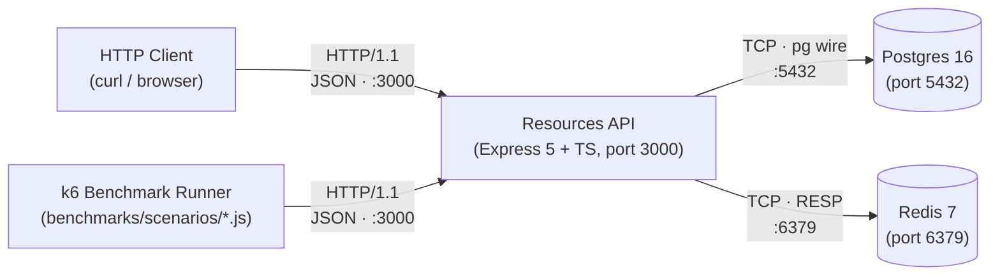
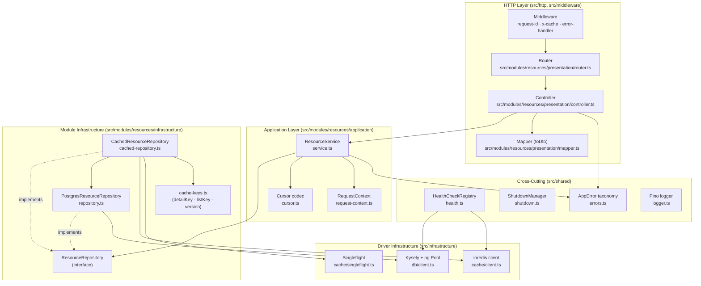
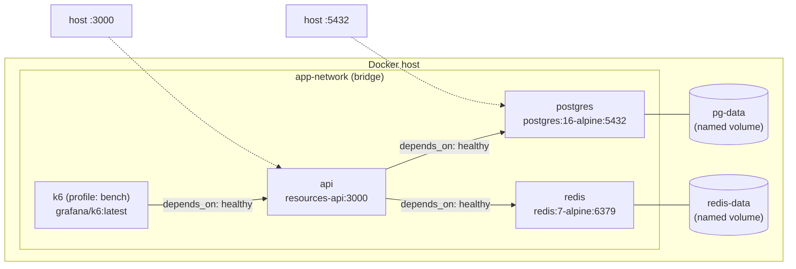
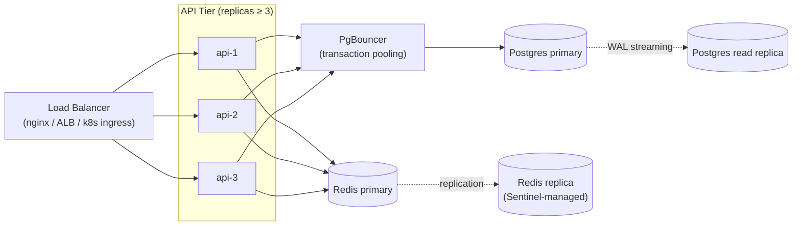

# Architecture

The Resources API is an HTTP CRUD service for a "resource" entity, backed by Postgres for durability and Redis for read-side caching. This document is the authoritative reference for **how the system is shaped**: what it talks to, how the modules decompose, what happens on a request, what the data looks like, how it deploys, and how it behaves when its dependencies fail.

It is intended to be read in under 10 minutes by anyone who has not seen the code. The diagrams come first (skim in 30 s), the deeper layering and enforcement rules come after.

For day-to-day commands and the project's operational surface, see [`README.md`](./README.md). For project-specific conventions that affect automated tooling, see [`CLAUDE.md`](./CLAUDE.md). For benchmark methodology and results, see [`Benchmark.md`](./Benchmark.md).

## Contents

- [Context Diagram](#context-diagram) — the service in its environment
- [Container Diagram](#container-diagram) — internal module decomposition
- [Request Flows](#request-flows) — sequence diagrams per endpoint (linked out)
- [Data Model](#data-model) — Postgres schema and Redis key taxonomy
- [Deployment](#deployment) — Docker Compose topology
- [Failure Modes](#failure-modes) — what breaks and how it degrades
- [Production Topology](#production-topology) — scale-out path beyond a single host
- [Directory Layout](#directory-layout) — `src/` tree
- [Dependency Direction](#dependency-direction) — layering rules
- [Two Kinds of Infrastructure](#two-kinds-of-infrastructure) — top-level vs module-level
- [Composition Layers](#composition-layers) — wiring chain from process to handler
- [What This Architecture Is NOT](#what-this-architecture-is-not) — explicit non-goals
- [Enforcement](#enforcement) — ESLint rules
- [Adding a Feature](#adding-a-feature) — step-by-step

## Context Diagram

The service sits between HTTP clients (curl, browsers, k6 benchmark runner) and two stateful dependencies (Postgres for durability, Redis for caching). Nothing else. There are no upstream services to call, no message queues, no external APIs.



The API is the only component that speaks to Postgres and Redis. Clients never reach the data tier directly.

## Container Diagram

Inside the API process, the request path decomposes into a small number of named modules. Each box on the diagram corresponds to a real file in `src/`. Arrows show dependency direction (`A → B` means `A imports B`).



The decomposition honors the layering rule **presentation → application → infrastructure** — each arrow points "inwards" (towards data), never the other way. The `CachedResourceRepository` is a decorator: it implements the same `ResourceRepository` interface as `PostgresResourceRepository` and delegates to it on miss, so the service is unaware of whether caching is enabled.

## Request Flows

Sequence diagrams for each endpoint live as standalone files under [`docs/architecture/`](./docs/architecture/) so this overview stays scannable. Each file is a single Mermaid diagram plus a short "key points" section — pick the one you need.

| Flow                              | File                                                              | When to read                                        |
|-----------------------------------|-------------------------------------------------------------------|-----------------------------------------------------|
| `GET /resources/:id` — cache HIT  | [docs/architecture/get-cache-hit.md](./docs/architecture/get-cache-hit.md)         | Understand the fast path                            |
| `GET /resources/:id` — cache MISS | [docs/architecture/get-cache-miss.md](./docs/architecture/get-cache-miss.md)       | Understand the slow path + singleflight             |
| `POST /resources`                 | [docs/architecture/post.md](./docs/architecture/post.md)                           | Understand write + list-cache invalidation          |
| `PATCH /resources/:id`            | [docs/architecture/patch.md](./docs/architecture/patch.md)                         | Understand partial update + detail-cache `DEL`      |
| `DELETE /resources/:id`           | [docs/architecture/delete.md](./docs/architecture/delete.md)                       | Understand hard delete + invalidation               |
| Cache invalidation (version-counter trick) | [docs/architecture/cache-invalidation.md](./docs/architecture/cache-invalidation.md) | Understand why one `INCR` invalidates every list page |
| `GET /healthz` (liveness + readiness) | [docs/architecture/health-check.md](./docs/architecture/health-check.md)       | Understand the parallel db/cache probes             |

The high-level shape every request shares: client → middleware (request-id, x-cache) → controller (Zod validation) → service → cached-repository decorator → (Redis or Postgres) → response. The decorator is a pass-through wrapper around `PostgresResourceRepository` — the service is unaware of whether caching is enabled.

## Data Model

### Postgres `resources` table

Defined by `migrations/0001_create_resources.ts` and typed in `src/infrastructure/db/schema.ts`. Five indexes support keyset pagination, the three filterable scalar columns, and tag containment.

| Column       | Type            | Nullable | Default               | Indexed                              | Description |
|--------------|-----------------|----------|-----------------------|--------------------------------------|-------------|
| `id`         | `uuid`          | NO       | `gen_random_uuid()`   | PK + composite (with `created_at`)   | Server-issued resource id |
| `name`       | `varchar(200)`  | NO       | —                     | —                                    | Human-readable label, ≤ 200 chars |
| `type`       | `varchar(64)`   | NO       | —                     | `resources_type_idx`                 | Caller-defined classification (e.g. `widget`) |
| `status`     | `varchar(32)`   | NO       | `'active'`            | `resources_status_idx`               | Lifecycle state |
| `tags`       | `text[]`        | NO       | `ARRAY[]::text[]`     | `resources_tags_gin_idx` (GIN, `@>`) | Free-form labels, queried with `tag=` |
| `owner_id`   | `uuid`          | YES      | —                     | `resources_owner_id_idx`             | Optional owner reference |
| `metadata`   | `jsonb`         | NO       | `'{}'::jsonb`         | —                                    | Free-form blob, capped at 16 KB at the Zod layer |
| `created_at` | `timestamptz`   | NO       | `now()`               | `resources_created_at_id_idx` (DESC, with `id`) | Insertion timestamp; drives keyset cursor |
| `updated_at` | `timestamptz`   | NO       | `now()`               | —                                    | Updated by the service on every write |

The composite index `(created_at DESC, id DESC)` is what makes keyset pagination cheap: `WHERE (created_at, id) < ($cursor_ts, $cursor_id)` is an index range scan, not a sort.

### Redis key taxonomy

Three key shapes, all prefixed with `resource:` so they can be flushed in one `SCAN MATCH 'resource:*'` if needed.

| Key pattern                                | Example                                                  | Purpose                                       | TTL                                | Invalidation trigger |
|--------------------------------------------|----------------------------------------------------------|-----------------------------------------------|------------------------------------|----------------------|
| `resource:v1:id:{uuid}`                    | `resource:v1:id:7f3c…`                                   | Detail cache for `GET /resources/:id`         | `CACHE_DETAIL_TTL_SECONDS` (300 s) | `DEL` on `PATCH` / `DELETE` of that id; TTL self-heals on `POST` (no DEL needed) |
| `resource:v1:list:{version}:{sha256-16}`   | `resource:v1:list:42:c9a1b2…`                            | List cache, keyed on filter tuple + version   | `CACHE_LIST_TTL_SECONDS` (60 s)    | Implicit on `INCR resource:list:version` (every list key embeds the old version, so they all become unreachable in one op) |
| `resource:list:version`                    | `resource:list:version` → `42`                           | List version counter (no namespace bump field) | none (persistent)                  | `INCR` on every successful `POST` / `PATCH` / `DELETE` |

The `{sha256-16}` is the first 32 hex chars (128 bits) of `sha256(canonical-json(filters))`, where `canonical-json` sorts object keys and array elements before serializing — so `?status=a&status=b` and `?status=b&status=a` resolve to the same cache key.

The `v1` segment is a manual schema-version field. Bumping `v1` → `v2` in code makes every existing entry unreachable, useful when the serialized shape changes incompatibly.

## Deployment

The default deployment is a single-host Docker Compose stack. Three long-lived services (`api`, `postgres`, `redis`) on a private bridge network, plus an optional `k6` sidecar gated behind the `bench` profile for benchmark runs.



Healthchecks gate startup: `api` does not start until `postgres` and `redis` report healthy, and the `api` healthcheck (`GET /healthz?probe=liveness`) is what `k6` waits on. Only `api` (port 3000) and `postgres` (port 5432) are exposed to the host; Redis stays inside the network.

## Failure Modes

What happens when a dependency goes away. The service is designed to **degrade**, not fail wholesale, when Redis is unavailable. Postgres is harder to lose because the cache cannot satisfy writes — but reads still survive on warm cache entries until they expire.

| Failed component       | Observable behavior                                                                                                                                       | Service status                                                              | Recovery action                                                                 |
|------------------------|-----------------------------------------------------------------------------------------------------------------------------------------------------------|-----------------------------------------------------------------------------|---------------------------------------------------------------------------------|
| **Redis down**         | `GET /resources/:id` and `GET /resources` fall through to Postgres (`X-Cache: MISS` on every request). Writes commit normally; cache invalidation `INCR` / `DEL` fail silently and are logged at `warn` (TTL bounds the staleness window). | **Degraded — fully functional**. `GET /healthz` → `503` with `checks.cache: down`. | Restart Redis. Cache repopulates lazily on the next read. No manual flush needed because the version counter is `INCR`-ed by the next write (or starts at 1 again, which is harmless). |
| **Postgres down**      | `GET /resources/:id` returns the cached value if `X-Cache: HIT`; on `MISS` the request fails with `500`. List requests fail unless the exact filter tuple + version is cached. All writes (`POST`/`PATCH`/`DELETE`) fail with `500`. | **Severely degraded — read-only on warm keys**. `GET /healthz` → `503` with `checks.db: down`. | Restart Postgres. Once healthy, writes resume. Stale cache entries naturally expire within `CACHE_DETAIL_TTL_SECONDS` / `CACHE_LIST_TTL_SECONDS`. |
| **Both Postgres and Redis down** | All reads fail with `500` (no cache, no source of truth). All writes fail. Health endpoint reports both checks down. | **Down**. `GET /healthz` → `503` with both `checks.db: down` and `checks.cache: down`. The container's healthcheck (`GET /healthz?probe=liveness`) still returns `200` because liveness is the fast path that does not query dependencies — so Docker keeps the container running rather than restart-looping. | Restart both backends in any order. Postgres healthcheck unblocks `api` (the `depends_on: service_healthy` gate). |
| **API process crash**  | Connections refused on port 3000. Docker Compose restart policy is `unless-stopped`, so the container is restarted automatically. In-flight requests are lost; clients retry. | **Down briefly** (single-replica deployment). | Automatic via Docker restart. Graceful shutdown drains in-flight requests within `SHUTDOWN_TIMEOUT_MS` on SIGTERM, so a planned restart loses no traffic. |
| **Slow Postgres (no outage)** | Read latency rises on `MISS`; warm hits remain microseconds. Writes block on the connection pool; if the pool is exhausted, requests queue and may time out. | **Degraded — cache absorbs read load**. `/healthz` still passes if the slow query stays under the healthcheck timeout. | Diagnose (slow query log, connection pool metrics). Raise `DATABASE_POOL_SIZE` or front Postgres with PgBouncer in transaction mode. |

The graceful-degradation behavior on Redis loss is documented in the `response-caching` capability spec and enforced by integration tests that kill the Redis container mid-test.

## Production Topology

A single-host Compose stack is the right shape for development, CI, and the take-home review. For production, the same topology fans out:



The scale-out points map directly to the bottlenecks observed in [`Benchmark.md`](./Benchmark.md):

- **Single API process** → horizontal replicas behind a load balancer. The service is stateless (all state lives in Postgres or Redis), so replicas need no coordination.
- **Postgres connection pool** → PgBouncer in transaction mode in front of a primary, with each replica's `pg.Pool` capped at 5–10 connections. Read-heavy workloads can fan out to a read replica via a connection-string switch in `DATABASE_URL`.
- **Redis single node** → Redis Sentinel for HA failover, or Redis Cluster for sharding once a single primary saturates. Cache-aside fits both transparently.
- **Co-located load generator** (relevant only to local benchmarks) → run k6 on a separate host or use k6 Cloud / distributed k6.

The `Benchmark.md` "Co-location penalty" section quantifies how much of the laptop result is artifact-of-environment vs real ceiling. Production numbers will be substantially higher on isolated hardware.

## Directory Layout

```
src/
├── config/                              # Startup-time Zod-validated env config
│   └── env.ts
├── shared/                              # Cross-cutting primitives, no feature knowledge
│   ├── errors.ts                        # AppError taxonomy
│   ├── health.ts                        # HealthCheckRegistry
│   ├── logger.ts                        # Pino logger factory
│   └── shutdown.ts                      # ShutdownManager
├── infrastructure/                      # Driver-level primitives (top-level)
│   ├── db/
│   │   ├── client.ts                    # Kysely + pg.Pool factory
│   │   ├── health.ts                    # DB health check
│   │   └── schema.ts                    # Kysely Database type definitions
│   └── cache/
│       ├── client.ts                    # ioredis factory
│       ├── health.ts                    # Redis health check
│       └── singleflight.ts              # In-process request coalescer
├── http/                                # Express wiring + non-feature routes
│   ├── app.ts                           # buildApp(logger, healthRegistry, db, cache)
│   └── routes/
│       └── health.ts                    # GET /healthz
├── middleware/                          # Express middleware shared across routes
│   ├── error-handler.ts
│   ├── request-id.ts
│   └── x-cache.ts
├── modules/
│   └── resources/                       # Feature module: resources
│       ├── presentation/                # HTTP adapters — router, controller, mapper
│       │   ├── router.ts
│       │   ├── controller.ts
│       │   └── mapper.ts                # toDto: DB row → response DTO
│       ├── application/                 # Business orchestration, cursor, request context
│       │   ├── service.ts
│       │   ├── cursor.ts
│       │   └── request-context.ts
│       ├── infrastructure/              # Feature-local data access + caching
│       │   ├── repository.ts
│       │   ├── cached-repository.ts
│       │   └── cache-keys.ts
│       ├── schema.ts                    # Zod schemas + inferred DTO types
│       └── index.ts                     # createResourcesModule(deps) → { router }
├── app.ts                               # createApp(deps) — DI entry point
└── index.ts                             # Process entry point
```

Each top-level directory under `src/` has a single purpose. A contributor opening `src/` sees the layout without reading any file.

## Dependency Direction

Within a feature module, dependencies flow in one direction:

```
presentation ──▶ application ──▶ infrastructure
     │               │
     └──────────┬────┘
                ▼
          schema.ts (module-root)
```

- **`presentation`** may import from `application` and the module-root `schema.ts`. It may not import from `infrastructure` directly.
- **`application`** may import from `infrastructure` and `schema.ts`. It may not import from `presentation`.
- **`infrastructure`** may not import from `application` or `presentation` except via `import type` for type-only references (e.g., `RequestContext`).
- **`schema.ts`** stays at the module root because both `presentation` (for request validation) and `application` (for typed input) consume it. Placing it inside a layer would force a cross-direction import.

At the top level:

- **`src/shared/`** and **`src/infrastructure/`** are terminal — feature modules import them, but they never reach into `src/modules/` or `src/http/`.
- **`src/http/`**, **`src/middleware/`**, **`src/config/`** are composition and transport wiring.
- **`src/app.ts`**, **`src/http/app.ts`**, **`src/index.ts`** are exempt from the layer rules — they are the composition root and must be allowed to wire every layer together.

## Two Kinds of Infrastructure

The project has two `infrastructure/` directories, at different scopes, and the distinction is deliberate:

- **Top-level `src/infrastructure/`** holds *driver-level* primitives every feature shares: the Postgres connection pool, the Redis client, and the drivers' health checks. These are constructed once in `src/index.ts` (or the integration test fixtures) and passed into `createApp(deps)`. They know nothing about any specific feature.
  - *Example:* `src/infrastructure/db/client.ts` exports a `createDb()` factory returning a `Kysely<Database>` wrapping a `pg.Pool`. It has no reference to the `resources` table.

- **Module-level `src/modules/<feature>/infrastructure/`** holds *feature-local* data access and caching: the Kysely queries for this feature's table, the cached decorator around that repository, the cache-key builder. It knows exactly which table and which cache-key scheme it owns.
  - *Example:* `src/modules/resources/infrastructure/repository.ts` exports `ResourceRepository` — a Kysely-backed class that issues `SELECT ... FROM resources WHERE ...` queries.

Naming both levels `infrastructure/` is honest: both hold code that owns external systems. The difference is *scope* — the top level is shared, the module level is scoped to one feature.

## Composition Layers

The wiring chain from process startup to request handling:

```
src/index.ts                          (process entry)
      │
      ▼   createApp({ config, logger, db, redis })
src/app.ts                            (DI entry point — test + prod share this)
      │
      ▼   buildApp(logger, healthRegistry, db, cache)
src/http/app.ts                       (Express wiring + middleware)
      │
      ▼   createResourcesModule({ db, cache, logger })
src/modules/resources/index.ts        (module factory)
      │
      ▼   returns { router }
   app.use('/resources', router)
```

**`createApp(deps)` is load-bearing** for the integration test suite — `tests/integration/fixtures/app.ts` constructs it with clients pointed at Testcontainers. Its external contract is preserved verbatim by any refactor: it accepts `{ config, logger, db, redis }` and returns `{ app, healthRegistry }`. Do not rename, split, or move it without a corresponding test-suite change.

Module factories (`createResourcesModule`) own their layer wiring: they construct the repository, optionally wrap it with the cached decorator, construct the service, build the controller, and assemble the Express router. `buildApp` in `src/http/app.ts` does not reach into a module's internal files — it sees a single factory that returns a router.

## What This Architecture Is NOT

Explicit non-goals — choices that were considered and rejected for this codebase:

- **No Domain-Driven Design.** There is no `Resource` entity with behavior, no value objects, no aggregates, no domain events. The "domain" is *a row in the `resources` table plus validation rules*; a domain layer would be empty ceremony.
- **No separate `domain/` layer.** The Zod-inferred input types belong to presentation (request validation); the Kysely row type belongs to infrastructure (database shape). There is no behavioral domain type between them that would justify a fourth layer.
- **No dependency-injection container.** Manual DI through constructor arguments and factory functions is simpler and more traceable than InversifyJS / TypeDI / Tsyringe for the handful of injectables this project has.
- **No formal ports/adapters split.** The `ResourceRepository` TypeScript interface already functions as the port, and `CachedResourceRepository` as the adapter. A separate `*.port.ts` / `*.adapter.ts` filename convention would add files without adding clarity.
- **No CQRS.** Reads and writes go through the same repository methods and the same service. Splitting them would double the file count without a behavioral benefit.
- **No event sourcing.** State lives in Postgres rows. There is no append-only event log.
- **No TypeScript path aliases.** `@shared/*`, `@infra/*` were considered and rejected. Aliases add tsconfig + bundler + test-runner + IDE configuration surface for a small readability win. They can be added later if import paths become painful.

## Enforcement

Layer direction is enforced at build time via ESLint `no-restricted-imports` (and `@typescript-eslint/no-restricted-imports` where type-only escape hatches are needed). Violations are lint errors, not review-time comments.

Current rules, in plain English:

1. **Presentation cannot import from infrastructure directly.** Files under `src/modules/*/presentation/` may not import from `**/infrastructure/**`. Type-only imports (`import type`) are allowed so `presentation/mapper.ts` can reference `import type { Resource } from '../../../infrastructure/db/schema.js'`.

2. **Infrastructure cannot import from application or presentation.** Files under `src/modules/*/infrastructure/` may not import from `**/application/**` or `**/presentation/**`. Type-only imports are allowed so `cached-repository.ts` can reference `import type { RequestContext }` and `repository.ts` can reference `import type { CursorPayload }`.

3. **Application cannot import from presentation.** Files under `src/modules/*/application/` may not import from `**/presentation/**` at all.

4. **Cross-module imports are forbidden.** Files under `src/modules/` may not reach across module boundaries. If two modules need to share code, extract it to `src/shared/`.

5. **`src/infrastructure/` and `src/shared/` cannot import from modules or transport.** These terminal layers must stay terminal.

6. **Composition layers are exempt.** `src/index.ts`, `src/app.ts`, and `src/http/app.ts` may import from any layer — they exist precisely to wire layers together.

7. **Tests are exempt.** Files under `tests/` may import from any layer.

## Adding a Feature

To add a new feature module `<feature>`:

1. `mkdir -p src/modules/<feature>/{presentation,application,infrastructure}`
2. Create `src/modules/<feature>/schema.ts` — Zod schemas and inferred DTO types. Use `.strict()` so unknown request fields fail loudly.
3. Create `src/modules/<feature>/infrastructure/repository.ts` — Kysely queries against the feature's table. The Kysely `Database` type in `src/infrastructure/db/schema.ts` must include the table first; update it before adding the repository.
4. Create `src/modules/<feature>/application/service.ts` — business orchestration. Accept the repository in its constructor; throw `AppError` subclasses from `src/shared/errors.ts` for failure cases.
5. Create `src/modules/<feature>/presentation/controller.ts` — per-route `RequestHandler` wrappers. Validate input with `schema.ts`, call the service, serialize with a sibling `mapper.ts` if the response shape differs from the DB row.
6. Create `src/modules/<feature>/presentation/router.ts` — mount the controller's handlers under an Express `Router`. Accept the controller as an argument (do not construct it here).
7. Create `src/modules/<feature>/index.ts` — export `create<Feature>Module(deps)` that constructs the repository → (cached wrapper, if applicable) → service → controller → router, and returns `{ router }`.
8. Wire the module into `src/http/app.ts`:
   ```ts
   import { createFeatureModule } from '../modules/<feature>/index.js';
   // inside buildApp:
   const feature = createFeatureModule({ db, logger, cache });
   app.use('/<feature>', feature.router);
   ```
9. Add tests under `tests/unit/modules/<feature>/{application,infrastructure}/` (mirror the source layout) and `tests/integration/<feature>/` (end-to-end through supertest). Tests may import from any layer.
10. Run `pnpm check` and `pnpm test` — both must pass.

The layering rules are enforced automatically — if step 5's controller reaches into step 3's repository directly, ESLint will fail the build. Route through the application layer.
