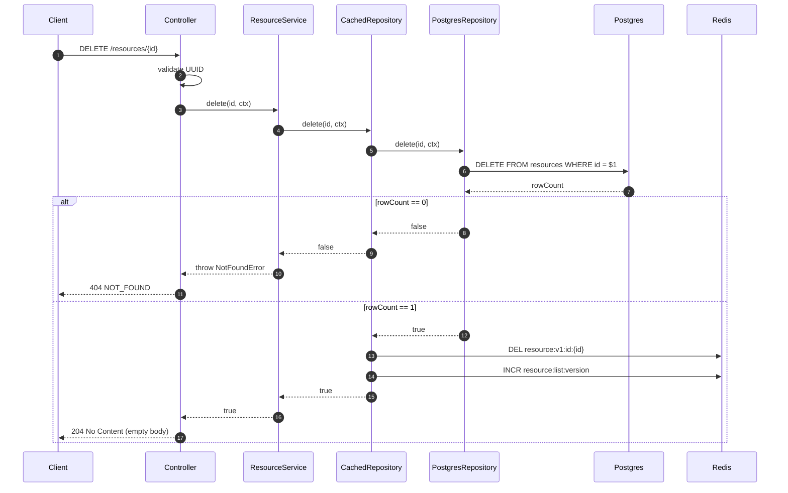

# DELETE /resources/:id — hard delete

Hard delete. The cache is invalidated the same way as PATCH (detail `DEL` + list version `INCR`). There is no soft-delete state in the schema.

## Key points

- **DELETE is idempotent in spirit but not in HTTP status.** Deleting a non-existent resource returns `404`, not `204`. Clients that need at-most-once semantics should ignore the 404 themselves.
- **No transactional bundling with the cache.** The Postgres delete commits first; cache invalidation runs afterwards as best-effort. A failed `DEL` means a stale detail entry lingers for up to `CACHE_DETAIL_TTL_SECONDS` (default 300 s) — acceptable, since reads of a deleted resource will return the old body briefly before TTL expiry.
- **Same fire-and-forget invalidation as PATCH.** Both Redis ops are wrapped in `try/catch`; failures are logged at `warn` and swallowed.

See [the cache invalidation flow](./cache-invalidation.md) for why one `INCR` is enough to invalidate every list page.
