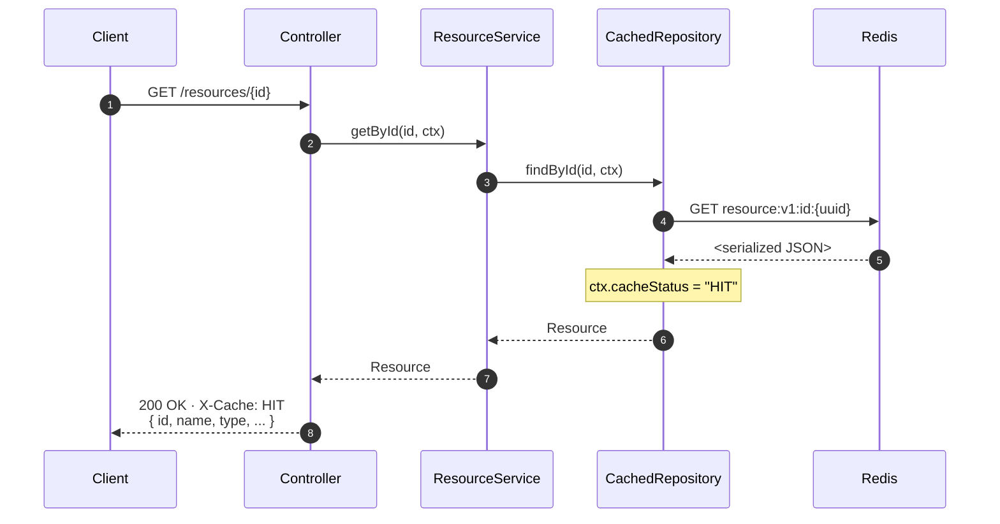

# GET /resources/:id — cache HIT

The fast path. Redis answers in microseconds, Postgres is never consulted.

## Key points

- The decorator (`CachedResourceRepository`) is the one component that touches Redis. The service is unaware of whether caching is enabled.
- `ctx.cacheStatus` is read by the `x-cache` middleware and rendered as the `X-Cache` response header. The header is suppressed when `NODE_ENV=production` to avoid leaking infrastructure details to external callers.
- A HIT serves the **exact same JSON** that was previously cached — no re-serialization, no DB row → DTO conversion.

See [`ARCHITECTURE.md`](../../ARCHITECTURE.md) for the layering rules and the cache-aside design.
