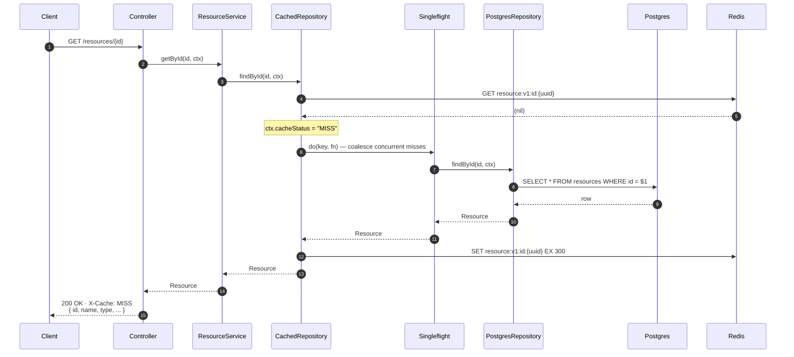

# GET /resources/:id — cache MISS

The slow path on first read. The result is cached with TTL `CACHE_DETAIL_TTL_SECONDS` (default 300 s), so the next request for the same id serves from cache. Concurrent misses for the same key are coalesced by an in-process **singleflight** so only one request actually hits Postgres.

## Key points

- **Negative results are NOT cached.** Caching a 404 would create a create-then-read race where a newly-created resource appears missing until the negative TTL expires.
- **Singleflight is in-process only.** Cross-process thundering herds are acceptable at this scale.
- **Redis outage is transparent.** Every Redis call is wrapped in `try/catch` — on failure, the request still falls through to Postgres and succeeds, with `X-Cache: MISS`. See [Failure Modes in ARCHITECTURE.md](../../ARCHITECTURE.md#failure-modes).
- The cache `SET` is **fire-and-forget**: a SET failure is logged at `warn` and swallowed. The response has already been computed.
