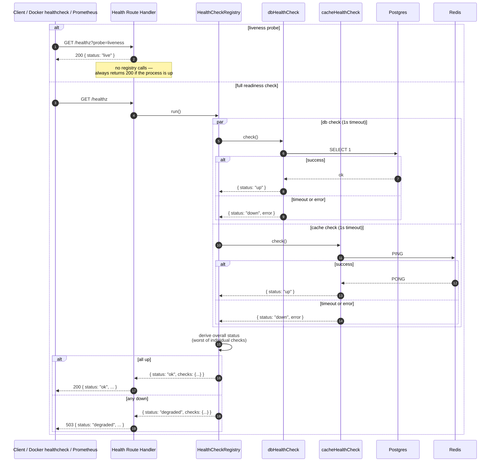

# GET /healthz — health check

`/healthz` uses an extensible **HealthCheckRegistry** so new dependencies register themselves at startup without modifying the route handler. As of S03, two checks are registered: `db` (Postgres) and `cache` (Redis). Each check runs in parallel with a 1-second timeout.

## Key points

- **Liveness vs readiness are different probes.** `?probe=liveness` is the fast path: it returns `200` if the process is up, without touching dependencies. This is what Docker's container healthcheck calls every 10 s. The full `/healthz` is the slow path: it runs every registered check and reports `503` if any are down. This separation prevents Docker from restart-looping the API container when only Redis is down (a degraded state, not a crashed process).
- **Checks run in parallel via `par`/`and`.** Total readiness latency is `max(check_durations)`, not `sum(check_durations)`. With a 1 s per-check timeout, the worst-case `/healthz` latency is ~1 s.
- **Each check has its own timeout.** A hung Postgres connection cannot block the cache check from reporting in time.
- **Overall status is the worst of the individual checks.** `up + up = ok`, `up + down = degraded`, `down + down = degraded`. The HTTP status code is `200` only when all checks pass.
- **The registry is extensible.** New dependencies (e.g. an upstream API in a future module) register themselves at startup with `healthRegistry.register('upstream', upstreamCheck)`. The route handler doesn't need to know they exist.

See [`HealthCheckRegistry` in src/shared/health.ts](../../src/shared/health.ts) for the implementation.
