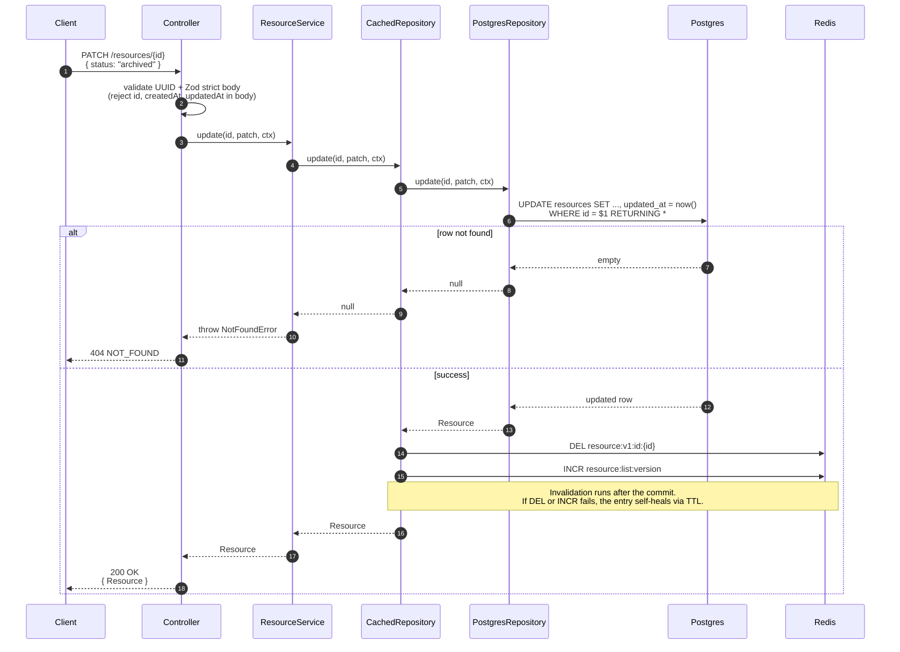

# PATCH /resources/:id — partial update

Updates invalidate **both** the detail key for the affected id (via `DEL`) and the list version counter (via `INCR`). The detail key needs an explicit `DEL` because the row's old contents are still cached under the same key.

## Key points

- **`updated_at` bumps on every PATCH**, even if no field semantically changed. This is a deliberate choice to make invalidation unconditional — the alternative would require an equality check that adds complexity for negligible gain.
- **Metadata is replaced, not merged.** `PATCH /resources/{id}` with `{metadata: {k: "v"}}` replaces the entire `metadata` object. Clients that want merge semantics GET, modify, and PATCH the merged result themselves.
- **`id`, `createdAt`, `updatedAt` are never writable.** The Zod `.strict()` schema rejects them with a `VALIDATION` error.
- **Two Redis ops, both fire-and-forget.** Either failing leaves the system in a recoverable state: a missed `DEL` self-heals at the detail TTL (300 s); a missed `INCR` only matters if the list cache was also serving stale pages, and those self-heal at the list TTL (60 s).

See [the cache invalidation flow](./cache-invalidation.md) for the version-counter mechanics.
