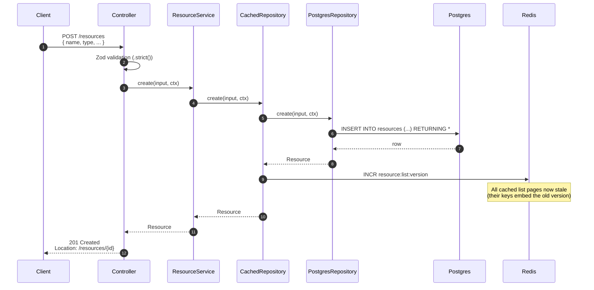

# POST /resources — write with cache invalidation

Writes go to Postgres first (source of truth), then bump the **list version counter** in Redis. Bumping the version invalidates every cached list page in one atomic INCR — no key scanning, no `KEYS *` antipattern. Existing detail keys are unaffected (a POST doesn't have an existing id to invalidate).

## Key points

- **Validation happens in the controller**, against the Zod `.strict()` schema. Unknown keys in the body fail with `400 VALIDATION` before any service call.
- **Postgres commit is the durability point.** The list-version `INCR` happens *after* the commit succeeds. A crash between the two is acceptable: list cache entries self-expire at their TTL (default 60 s).
- **Cache invalidation is fire-and-forget.** If the `INCR` fails (Redis down), it's logged at `warn` and swallowed — the write has already committed and the response is correct.
- **No detail key written.** A POST doesn't have a read to cache; the next `GET /resources/{id}` will populate the detail key on first miss.

See [the cache invalidation flow](./cache-invalidation.md) for why one `INCR` is enough to invalidate every list page.
