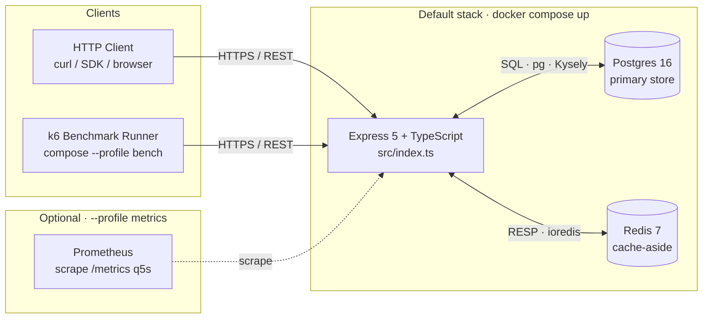
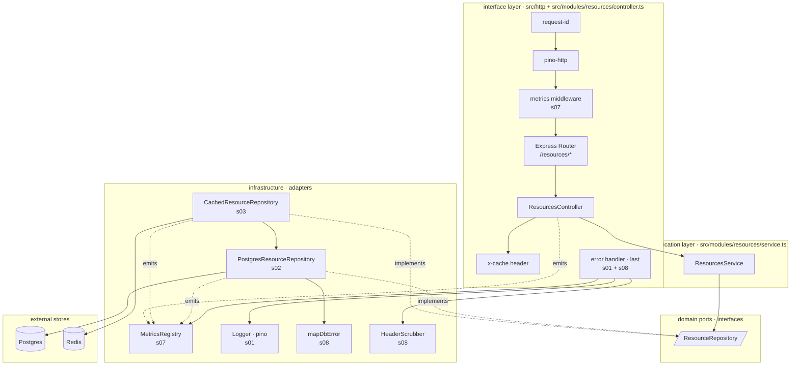
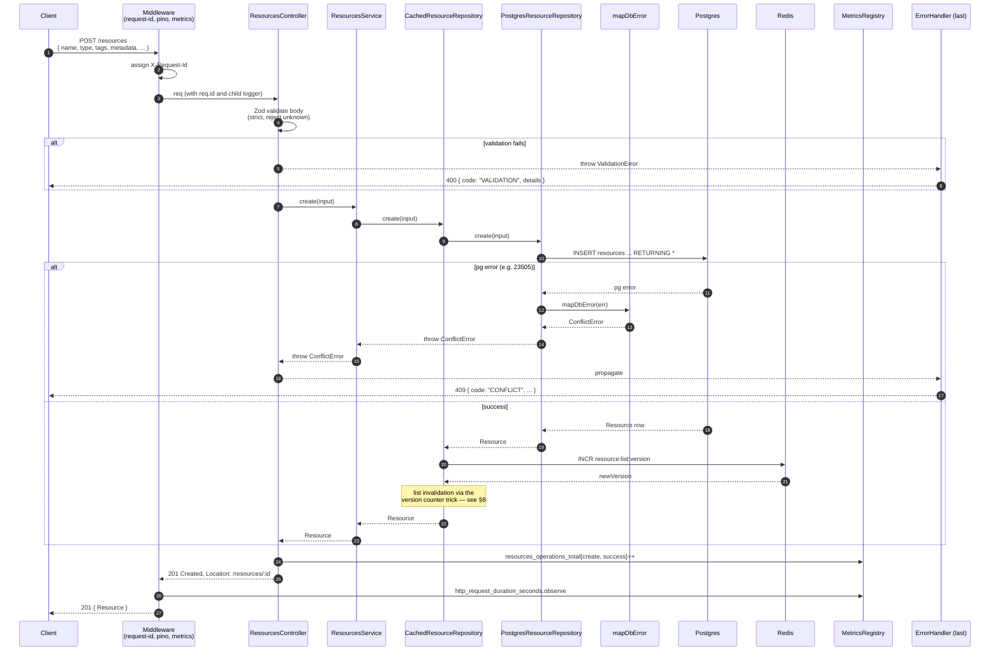
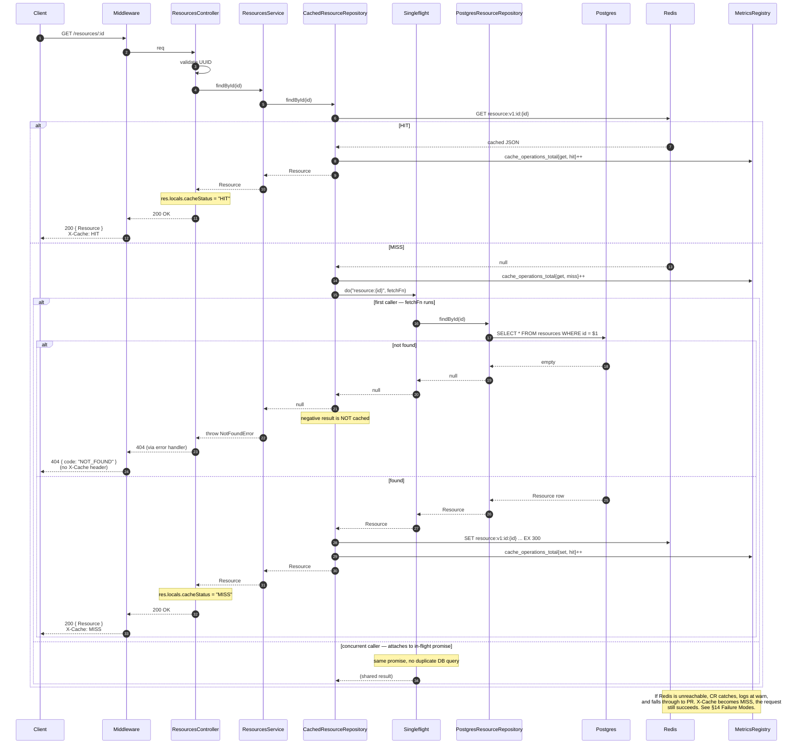
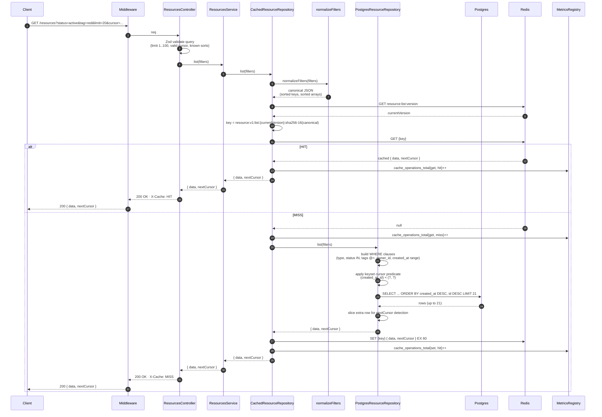
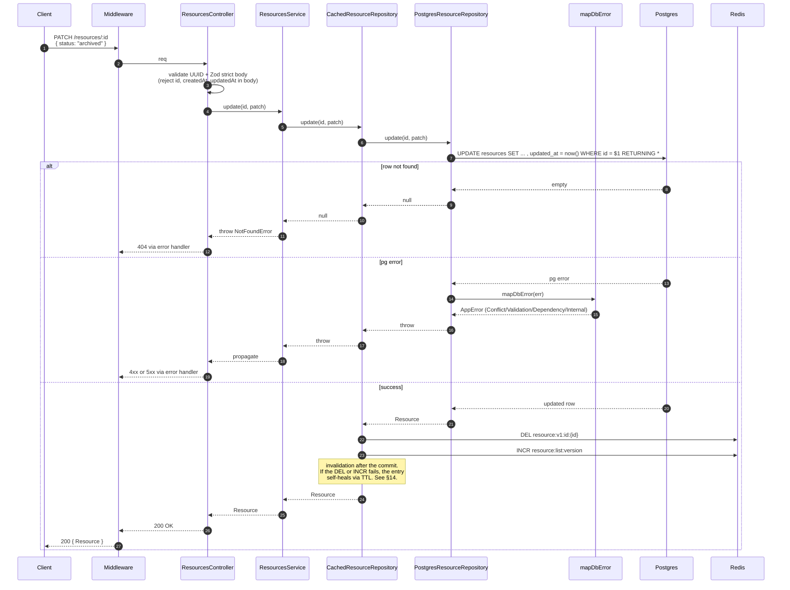
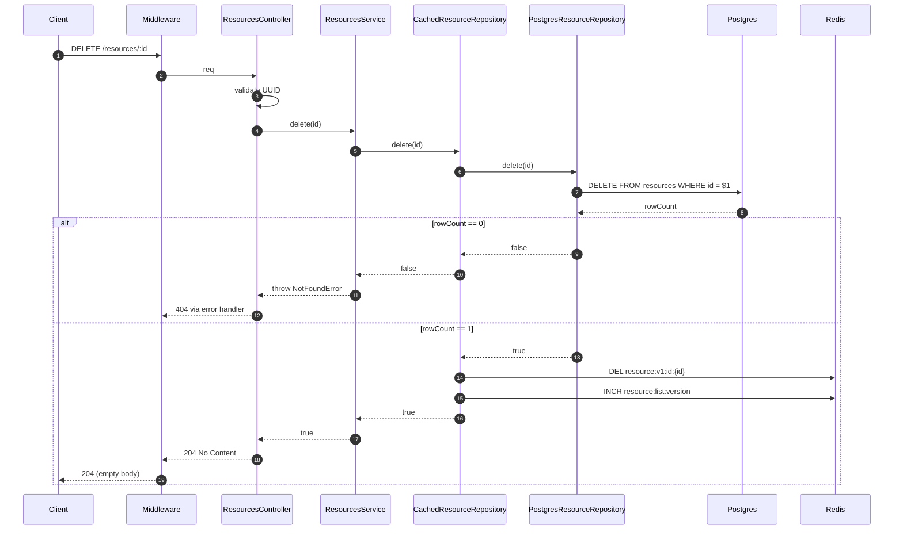
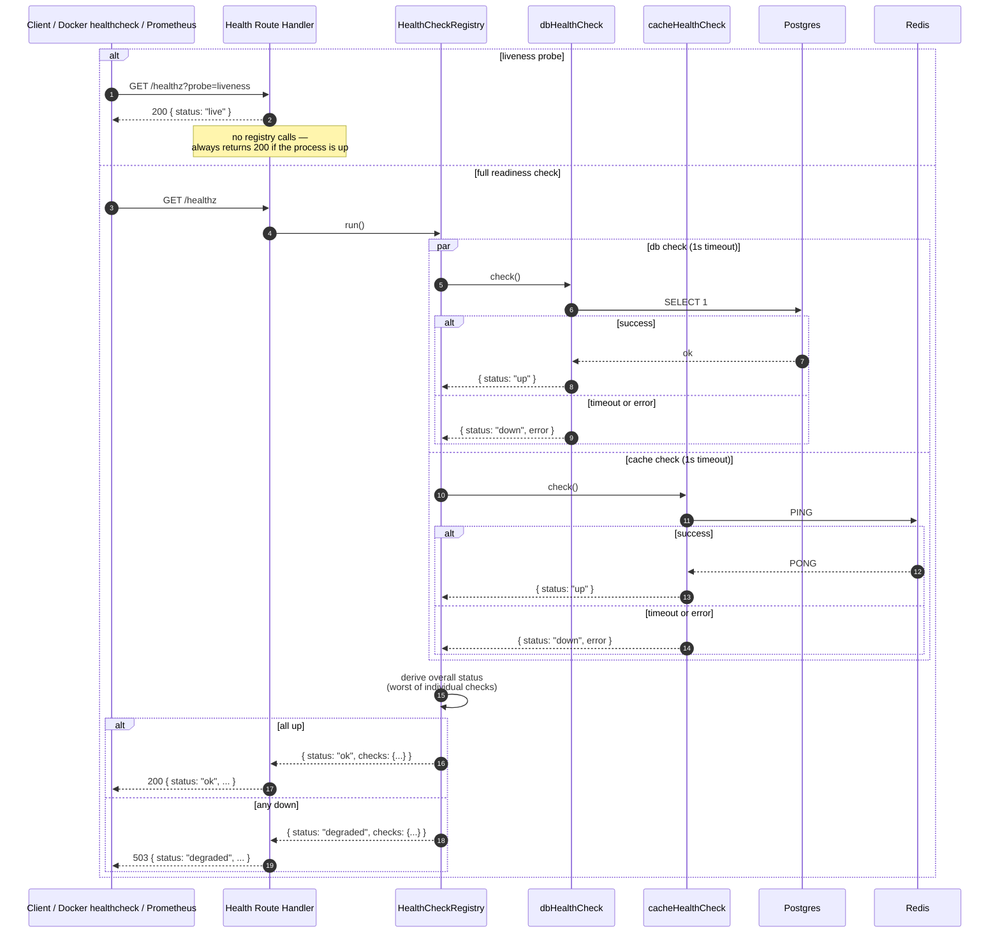
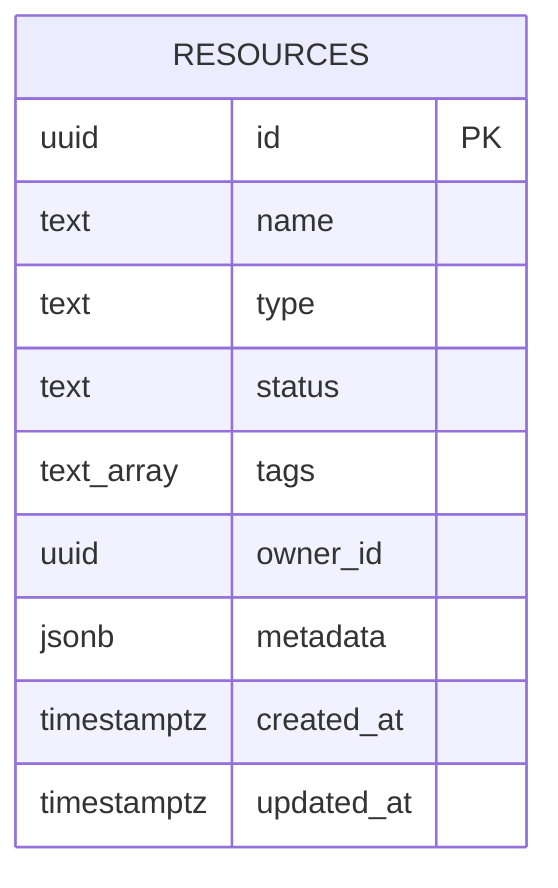
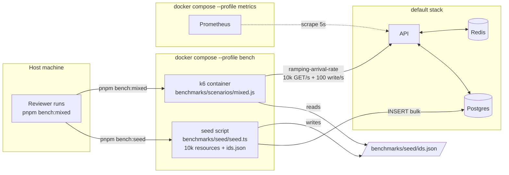

# Flow Diagrams — Resources API

All diagrams below are [Mermaid](https://mermaid.js.org/). They render natively on GitHub, GitLab, and most modern markdown renderers.

This document is the flow-level companion to `Architecture.md` (from `s06-add-architecture-docs`). Where `Architecture.md` answers *"what are the boxes and how are they wired,"* this document answers *"what happens on a request, step by step, across layers."* It reflects the full system as specified across OpenSpec changes `s01`–`s08`.

## Contents

1. [System Topology](#1-system-topology)
2. [Layered Architecture](#2-layered-architecture)
3. [Sequence — Create Resource (POST)](#3-sequence--create-resource-post)
4. [Sequence — Get Resource by Id (cache HIT and MISS)](#4-sequence--get-resource-by-id-cache-hit-and-miss)
5. [Sequence — List Resources (with filters)](#5-sequence--list-resources-with-filters)
6. [Sequence — Update Resource (PATCH)](#6-sequence--update-resource-patch)
7. [Sequence — Delete Resource](#7-sequence--delete-resource)
8. [Cache Invalidation — the version-counter trick](#8-cache-invalidation--the-version-counter-trick)
9. [Sequence — Health Check](#9-sequence--health-check)
10. [Sequence — Prometheus Scrape](#10-sequence--prometheus-scrape)
11. [Sequence — Error Handling (security-aware)](#11-sequence--error-handling-security-aware)
12. [Data Model — Postgres schema and Redis keys](#12-data-model--postgres-schema-and-redis-keys)
13. [Benchmark Topology (k6)](#13-benchmark-topology-k6)
14. [Failure Modes — what happens when…](#14-failure-modes--what-happens-when)
15. [Notes on Notation](#notes-on-notation)

---

## 1. System Topology

The default stack is three containers. Activating the `metrics` compose profile adds a fourth (Prometheus) that scrapes the API's `/metrics` endpoint on a 5-second interval.



**Notes:**

- The API is a single process by default. Horizontal scaling (multiple replicas behind a load balancer) is documented in `Architecture.md` as the production scale-out story.
- k6 runs as a separate compose service under the `bench` profile; it is not part of the default stack.
- Prometheus is entirely optional (profile-gated). Reviewers who only want to `curl /metrics` do not need to start Prometheus.

---

## 2. Layered Architecture

The HTTP layer is deliberately thin. The cache is a **decorator** around the repository interface, so the service is unaware of whether a cache exists (`s03-add-redis-caching` Decision 4).



**Dependency rule:** Controllers depend on the service. The service depends on the **repository interface**, not on a concrete implementation. At wiring time, `CachedResourceRepository` wraps `PostgresResourceRepository` when `CACHE_ENABLED=true`; otherwise the Postgres repository is injected directly. This is how the cache on/off kill switch works without any `if (cache) { ... }` branches in the service code.

---

## 3. Sequence — Create Resource (POST)

Happy-path POST. The cache is never populated on create (we don't have a read to cache yet), but the **list version counter** is bumped so any cached list pages become unreachable and future list requests re-read from Postgres.



**Key points:**

- Validation happens in the **controller** against the Zod schema (`s02`), before any service call.
- Postgres errors are wrapped at the **repository** boundary (`s08` Decision 6) so the service sees only typed `AppError` subclasses.
- The list version counter bump happens *after* the Postgres commit succeeds; a crash in between is acceptable because list cache entries self-expire at their TTL.

---

## 4. Sequence — Get Resource by Id (cache HIT and MISS)

Both cache branches in a single diagram. The singleflight wrapper ensures that a burst of concurrent misses on the same hot key produces exactly one Postgres query (`s03` Decision 5).



**Key points:**

- **Negative results are NOT cached.** Caching a 404 would create a create-then-read race where a newly-created resource appears missing until the negative TTL expires (`s03` Decision in Open Questions).
- **Singleflight** is in-process only. Cross-process thundering herds are acceptable at our scale (`s03` Decision 5).
- **Redis outage is transparent to the caller.** The `try/catch` around every Redis call falls through to Postgres on failure (`s03` Decision 6).

---

## 5. Sequence — List Resources (with filters)

List caching uses the version-counter trick from `s03` so writes invalidate all list pages in O(1) work. The cache key embeds the current list version, so after a write bumps the counter, every future list request constructs a new key that misses the cache.



**Key points:**

- **Keyset pagination, not offset.** The repository issues `LIMIT 21` (one extra row) so it can detect whether another page exists without a second query. The 21st row becomes the `nextCursor`; only 20 are returned to the client (`s02` Decision 2).
- **Filter normalization matters.** `?status=active&type=widget` and `?type=widget&status=active` produce the same cache key because `normalizeFilters` sorts keys alphabetically and array values deterministically (`s03` Decision 3).
- **Two Redis GETs on HIT, one on MISS.** The first fetches the list version, the second fetches the page. We use a single Redis pipeline where possible to combine them.

---

## 6. Sequence — Update Resource (PATCH)

Updates invalidate both the detail key for the affected id and the list version counter. The public response shape is strict (`s08`) — `updatedAt` is bumped even if no field semantically changed.



**Key points:**

- **Patch is idempotent-ish:** `updatedAt` bumps on every PATCH even if no field changed. This is a deliberate choice (`s02` Design Open Questions) to make invalidation unconditional — the alternative would require an equality check that adds complexity for negligible gain.
- **Metadata is replaced, not merged.** `PATCH /resources/:id` with `{metadata: {k: "v"}}` replaces the entire `metadata` object. Clients that want merge semantics GET, modify, and PATCH the merged result themselves (`s02` Decision 5).
- **`id`, `createdAt`, `updatedAt` are never writable.** The Zod strict schema rejects them with a `VALIDATION` error (`s02` spec scenario).

---

## 7. Sequence — Delete Resource

Hard delete. The cache is invalidated the same way as update (detail DEL + list version INCR).



---

## 8. Cache Invalidation — the version-counter trick

Why this is worth its own diagram: list-query invalidation is the hardest problem in cache-aside, and the version-counter trick (`s03` Decision 2) is the one design call that lets us skip building a reverse index.

```mermaid
flowchart TB
    W[Write op<br/>create / update / delete] --> PG[(Postgres commit)]
    PG --> INC[INCR resource:list:version]
    INC --> NEW[version = N+1]

    subgraph Before[Before the write]
        K1[resource:v1:list:N:hash-abc<br/>reachable by reads]
        K2[resource:v1:list:N:hash-def<br/>reachable by reads]
        K3[resource:v1:list:N:hash-ghi<br/>reachable by reads]
    end

    subgraph After[After the write]
        K1X[resource:v1:list:N:hash-abc<br/>orphan, TTL self-expires]
        K2X[resource:v1:list:N:hash-def<br/>orphan, TTL self-expires]
        K3X[resource:v1:list:N:hash-ghi<br/>orphan, TTL self-expires]
        KNEW[resource:v1:list:N+1:hash-abc<br/>new reads land here]
    end

    NEW -. "invalidates all of these" .-> K1X
    NEW -. .-> K2X
    NEW -. .-> K3X
    NEW --> KNEW

    style K1 fill:#d4f4dd
    style K2 fill:#d4f4dd
    style K3 fill:#d4f4dd
    style K1X fill:#f4d4d4
    style K2X fill:#f4d4d4
    style K3X fill:#f4d4d4
    style KNEW fill:#d4f4dd
```

**How it works:**

1. Every list cache key embeds the **current** value of `resource:list:version`.
2. On any write, `INCR resource:list:version` atomically.
3. After the increment, every future list request constructs a key with the new version — the old keys become **unreachable** because no request will ever construct them again.
4. The old keys remain in Redis but **orphan-expire** via their TTL (60 s). Memory pressure is bounded.

**Trade-off:** We waste some Redis memory on orphan keys for up to 60 s. We save building a reverse index from "filter tuple" → "list keys containing this resource". The memory waste is measured in kilobytes per second of orphans; the reverse index would be hundreds of lines of bookkeeping code with its own bug surface.

---

## 9. Sequence — Health Check

`/healthz` uses a **registry** (`s01` Decision 5) so new dependencies register themselves at startup without modifying the route handler. By the time all of `s01`–`s03` are implemented, two checks are registered: `db` and `cache`.



**Key points:**

- **Liveness vs. readiness separation.** Liveness answers "is the process alive?" and is used by Docker's container healthcheck (fast, cheap, never false-positive). Readiness answers "are all upstream dependencies reachable?" and is used by load balancers / orchestrators to remove unhealthy instances from rotation.
- **Per-check timeout.** Each check has an independent 1-second timeout. A slow Postgres does not prevent the cache check from reporting.
- **Registry-based.** Future dependencies (e.g., a third-party identity service if auth lands) add themselves via `registry.register("idp", idpCheck)` without touching the route handler.

---

## 10. Sequence — Prometheus Scrape

The compose `metrics` profile adds a Prometheus container that scrapes `/metrics` every 5 seconds (`s07-add-prometheus-metrics`).

```mermaid
sequenceDiagram
    autonumber
    participant PM as Prometheus<br/>(compose --profile metrics)
    participant API as Express API
    participant MR as MetricsRegistry<br/>(prom-client)

    loop every 5s
        PM->>API: GET /metrics<br/>Host: api:3000
        alt METRICS_ENABLED=true
            API->>API: skip this request in http_request_duration_seconds<br/>(the scrape route is excluded)
            API->>MR: render()
            MR->>MR: collect default metrics<br/>(process, nodejs, gc, eventloop)
            MR->>MR: collect custom metrics<br/>(http_*, cache_*, db_*, resources_*)
            MR-->>API: text/plain exposition format
            API-->>PM: 200 OK · Content-Type: text/plain; version=0.0.4
        else METRICS_ENABLED=false
            API-->>PM: 404 Not Found
        end
    end
```

**Cardinality guards** (`s07` Decision 2):

- The `route` label is `req.route?.path` (Express matched pattern) — NOT `req.originalUrl`. So 10k requests to `/resources/{different-uuid}` produce 1 series, not 10k.
- Unmatched routes collapse to `route="__unmatched"` (one sentinel series, not one per unknown path).
- `error_class` labels are allowlisted against a fixed set of pg error classes; unknown codes map to `"other"`.
- Scrape requests are **not** recorded in the HTTP histogram (would create a self-perpetuating series that grows with every scrape).

---

## 11. Sequence — Error Handling (security-aware)

The error pipeline from `s08-add-error-handling`. Rich dev logs and minimal public responses in the same middleware. Note the **allowlist-based** public response construction — fields are copied explicitly, never serialized from the error object.

```mermaid
sequenceDiagram
    autonumber
    participant H as Request Handler
    participant MW as Middleware chain
    participant ERR as ErrorHandler middleware
    participant WRAP as wrapUnknown
    participant META as buildErrorMetadata
    participant SCRUB as scrubHeaders
    participant TPR as toPublicResponse
    participant LOG as Logger (pino)
    participant MR as MetricsRegistry
    participant C as Client

    H-->>MW: throw err
    MW->>ERR: next(err)
    ERR->>ERR: generate errorId = uuid()
    ERR->>WRAP: wrapUnknown(err)
    alt err is AppError
        WRAP-->>ERR: err (pass-through)
    else err is not AppError
        WRAP-->>ERR: InternalError { cause: err }
        Note over WRAP: original attached as cause<br/>for logging, never exposed
    end
    ERR->>META: buildErrorMetadata(err, req, res)
    META->>SCRUB: scrubHeaders(req.headers)
    SCRUB-->>META: headers with Authorization/Cookie/etc replaced by "[REDACTED]"
    META-->>ERR: payload<br/>{errorId, errorClass, code, status, stack, cause[], requestId, method, route, headers*, query, body.size, body.contentType, userAgent, remoteAddr, timestamp}

    alt status < 500
        ERR->>LOG: warn(metadata, err.message)
    else status >= 500
        ERR->>LOG: error(metadata, err.message)
    end
    ERR->>MR: errors_total{code, status}++

    ERR->>TPR: toPublicResponse(err, req.id, status >= 500 ? errorId : null)
    TPR->>TPR: build body from scratch<br/>{error: {code, message (truncated 200ch), requestId, details?, errorId?}}
    alt err is InternalError
        TPR->>TPR: message = "Internal server error"<br/>(generic; original message stays in log only)
    end
    TPR->>TPR: details only for ValidationError<br/>(array of {path, code, message})
    TPR->>TPR: errorId only for 5xx<br/>(correlation with log entry)
    TPR-->>ERR: { status, body }
    ERR-->>C: <status> { error: { ... allowlist only ... } }

    Note over LOG,C: Log entry contains stack, cause, sanitized headers — everything for the engineer.<br/>Response body contains only the allowlist — nothing for the attacker.
```

**Why allowlist (not denylist):**

- A denylist ("strip these 20 dangerous substrings") misses the 21st.
- The allowlist constructs the response body from scratch in `toPublicResponse`. A new field can only appear in the response if someone explicitly adds it to that one function. `s08` Decision 1.
- A belt-and-braces integration test (`tests/integration/errors/leak.test.ts`) grep-checks every error response body against a denylist of leak indicators (`pg`, `kysely`, `node_modules`, `SELECT`, `at /`, etc.) as a regression trap, not as the primary guarantee.

---

## 12. Data Model — Postgres schema and Redis keys

### 12.1 Postgres schema



**Indexes** (`s02-add-resources-crud` Decision 3):

| Index | Purpose |
|---|---|
| `PRIMARY KEY (id)` | point lookups |
| `(created_at DESC, id DESC)` | default sort + keyset pagination |
| `(type)` | `?type=` filter |
| `(status)` | `?status=` filter (OR-combined across multiple values) |
| `(owner_id)` | `?ownerId=` filter |
| `GIN (tags)` | `?tag=x&tag=y` (AND-combined via `tags @> ARRAY['x','y']`) |

No composite indexes — single-column indexes plus the Postgres planner's bitmap-AND strategy is the right trade-off for this filter surface at our write rate.

### 12.2 Redis key taxonomy

| Key pattern | Purpose | TTL | Invalidation |
|---|---|---|---|
| `resource:v1:id:{uuid}` | cached full Resource body for `GET /resources/:id` | 300 s (configurable via `CACHE_DETAIL_TTL_SECONDS`) | `DEL` on update + delete |
| `resource:v1:list:{version}:{sha256-16(canonicalFilters)}` | cached `{data, nextCursor}` for a specific list query under a specific list version | 60 s (configurable via `CACHE_LIST_TTL_SECONDS`) | version bump makes old keys unreachable; orphans TTL-expire |
| `resource:list:version` | monotonically-incrementing list version counter | no TTL (persistent) | `INCR` on any write |

Key properties:

- Every key is prefixed with `resource:v1:` to allow schema-level versioning of the cache format without a manual flush (`s03` Decision 3).
- Keys are bounded in length (≤ 80 bytes).
- Values are JSON — deliberately human-readable for `redis-cli GET` debugging (`s03` Decision 4).

---

## 13. Benchmark Topology (k6)

When a reviewer activates the `bench` compose profile, a k6 container runs scenarios against the API within the compose network. The `metrics` profile can be layered on top so Prometheus captures server-side telemetry during the run.



**Why Prometheus alongside k6:**

- k6 measures from the **outside** — latency and throughput from the client's perspective.
- Prometheus measures from the **inside** — event loop lag, GC pauses, Postgres connection pool saturation, Redis hit rate, `/resources/:id` vs `/resources` percentile split.
- Correlating the two (e.g. "k6 saw a p99 spike at T+120; Prometheus shows `nodejs_eventloop_lag` doubled at T+119") is how you diagnose real performance bugs.

See `Benchmark.md` (from `s05-add-benchmarks-k6`) for the scenarios, methodology, and recorded results.

---

## 14. Failure Modes — what happens when…

| Failure | Observable effect | Service status | Recovery |
|---|---|---|---|
| **Postgres down** | `GET /resources/:id` succeeds from the cache (with `X-Cache: HIT`) until the entry expires; cache misses and writes fail with `503 DEPENDENCY_UNAVAILABLE`; `/healthz` returns `503` with `checks.db.status = "down"`; `cache_operations_total` still flowing | Degraded — read-only on hot cache keys | Restart Postgres; no data loss; next write succeeds and invalidates the (stale) cache correctly |
| **Redis down** | All GET requests fall through to Postgres with `X-Cache: MISS`; writes still commit to Postgres; cache invalidation is logged at `warn` and silently skipped (entries self-heal via TTL); `/healthz` returns `503` with `checks.cache.status = "down"`; `cache_operations_total{result="error"}` climbs | Degraded — Postgres-bottlenecked but correct | Restart Redis; cache re-populates on the next GET per key |
| **Both Postgres and Redis down** | Reads fail with `503 DEPENDENCY_UNAVAILABLE` on cache miss; cache-hit reads continue to succeed briefly (until TTL expiry); writes fail; `/healthz` returns `503` with both checks down | Hard failure | Restart the stack; no data loss |
| **Redis slow but reachable** | GET latency inflates proportionally; cache ops report `cache_operation_duration_seconds` spikes; no errors | Slow but functional | Profile the Redis host (network, CPU, memory pressure); consider per-command timeout |
| **Postgres connection pool saturated** | New requests queue inside the pool's waiting queue; `db_pool_size{state="waiting"}` > 0; per-request latency climbs; eventually requests time out with `DependencyError` | Degraded — latency-bound | Increase `max` pool size, reduce write rate, or add PgBouncer (production scale-out) |
| **API process killed mid-request** | In-flight requests fail from the client's perspective; no transactional rollback needed (single-statement queries); `/healthz` probe fails until the new process boots | Brief unavailability | Docker restart policy or orchestrator relaunches the container |
| **Cache invalidation DEL fails (network blip)** | Stale detail cache served until TTL expiry (up to 300 s) | Silently inconsistent | Logged at `warn`; next write bumps the list counter regardless; detail key self-heals on TTL — no manual intervention needed |
| **Cache version counter corrupted** (unlikely) | List cache effectively invalidated globally; all list requests hit Postgres until new entries populate | Slower lists for ~60 s | `DEL resource:list:version && SET resource:list:version 0` and restart stack; or let it orphan-expire |
| **Unknown error thrown in handler** | `wrapUnknown` wraps in `InternalError`; response is `500 INTERNAL_ERROR` with generic message and `errorId`; log entry has full stack + cause chain + sanitized headers | Per-request failure | Operator greps logs by `errorId` and diagnoses |
| **Prometheus cannot reach /metrics** | Scrape target shows `DOWN` in Prometheus UI; no effect on API behavior | Healthy API, broken observability | Check compose network, `METRICS_ENABLED` flag, firewall |
| **Benchmark run saturates the API on laptop** | k6 reports rising p99 latency and climbing error rate; `stress.js` scenario stops at breaking point | Expected — that's what the benchmark is for | Document the breaking point in `Benchmark.md`; scale-out story explains production path |

---

## Notes on Notation

- **Solid arrows** in sequence diagrams are synchronous calls within a request (`->>`).
- **Dashed return arrows** are response messages (`-->>`).
- **Dotted lines** in graph/flowchart diagrams (`-.->` ) indicate "implements," "emits," or "eventual" relationships.
- **`alt` / `else` / `end`** blocks in sequence diagrams represent branches (e.g. cache HIT vs MISS, success vs error).
- **`par` / `and`** blocks indicate parallel execution (used in the health check for concurrent per-dependency probes).
- **Colors** in the cache invalidation diagram (§8) are advisory: green = reachable, red = orphan. GitHub's Mermaid renderer honors `style` directives.
- Every diagram omits TLS termination, request-id middleware (except where relevant), and metrics instrumentation (except where it's the subject) to stay readable. Assume they apply everywhere.
- **Express route patterns** (`/resources/:id`) are used in labels for any metric label or log field, **never** the resolved URL (`/resources/abc-123`). This is a cardinality guard — see §10 and `s07-add-prometheus-metrics` Decision 2.

---

## Cross-References

| Topic | OpenSpec change | Spec file | Design file |
|---|---|---|---|
| Bootstrap, config, logging, health, shutdown | `s01-add-project-scaffold` | `specs/project-bootstrap/spec.md`, `specs/local-dev-environment/spec.md` | `design.md` |
| Resource CRUD, filters, keyset pagination, DB indexes | `s02-add-resources-crud` | `specs/resources-management/spec.md` | `design.md` |
| Cache-aside, version counter, singleflight, X-Cache header | `s03-add-redis-caching` | `specs/response-caching/spec.md` | `design.md` |
| Vitest + Testcontainers, coverage gate | `s04-add-test-suite` | `specs/testing-framework/spec.md` | `design.md` |
| k6 scenarios, Benchmark.md, laptop honesty | `s05-add-benchmarks-k6` | `specs/performance-benchmarking/spec.md` | `design.md` |
| Architecture.md, mermaid diagrams, README polish | `s06-add-architecture-docs` | `specs/architecture-documentation/spec.md` | `design.md` |
| Prometheus integration, cardinality guards, compose profile | `s07-add-prometheus-metrics` | `specs/metrics-observability/spec.md` | `design.md` |
| Error taxonomy, dev-log enrichment, public response allowlist, pg error mapping | `s08-add-error-handling` | `specs/error-handling/spec.md`, `specs/project-bootstrap/spec.md` (MODIFIED), `specs/resources-management/spec.md` (MODIFIED) | `design.md` |

Every behavior depicted in a diagram above traces back to a scenario in one of these spec files. If a diagram and a spec disagree, **the spec is canonical**.
