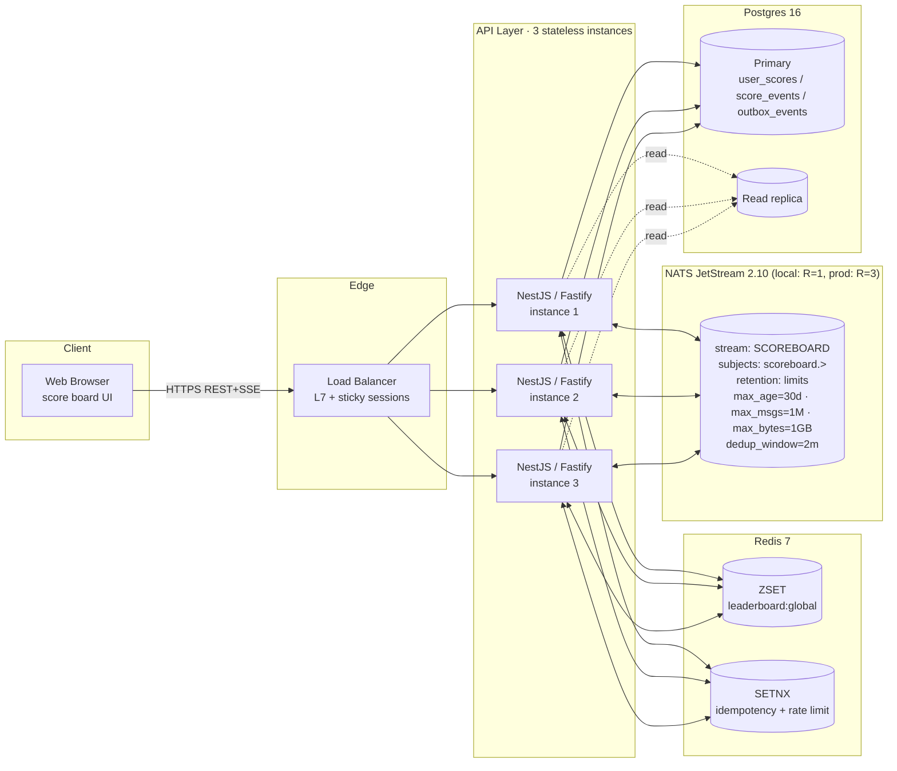
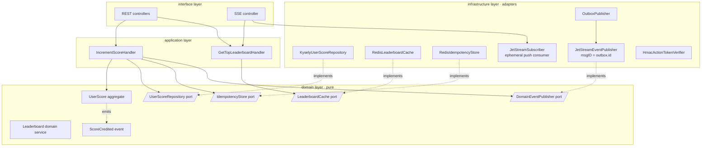
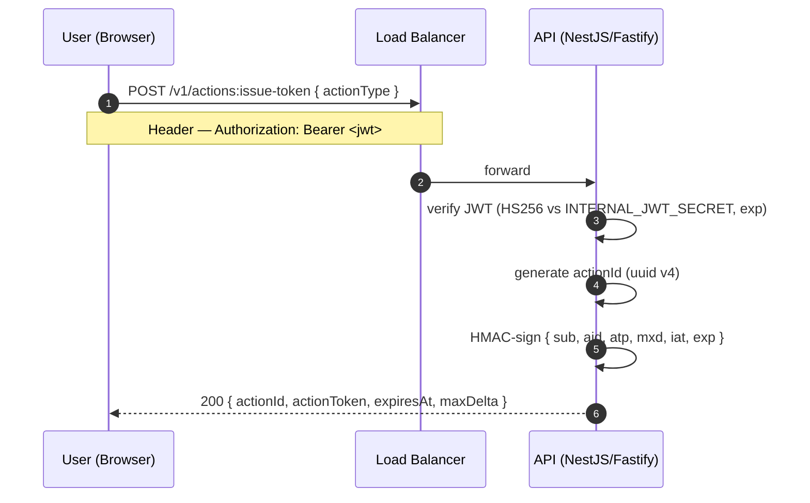
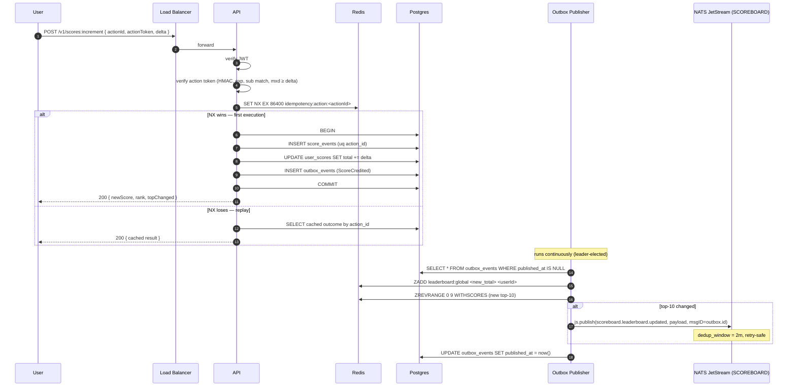
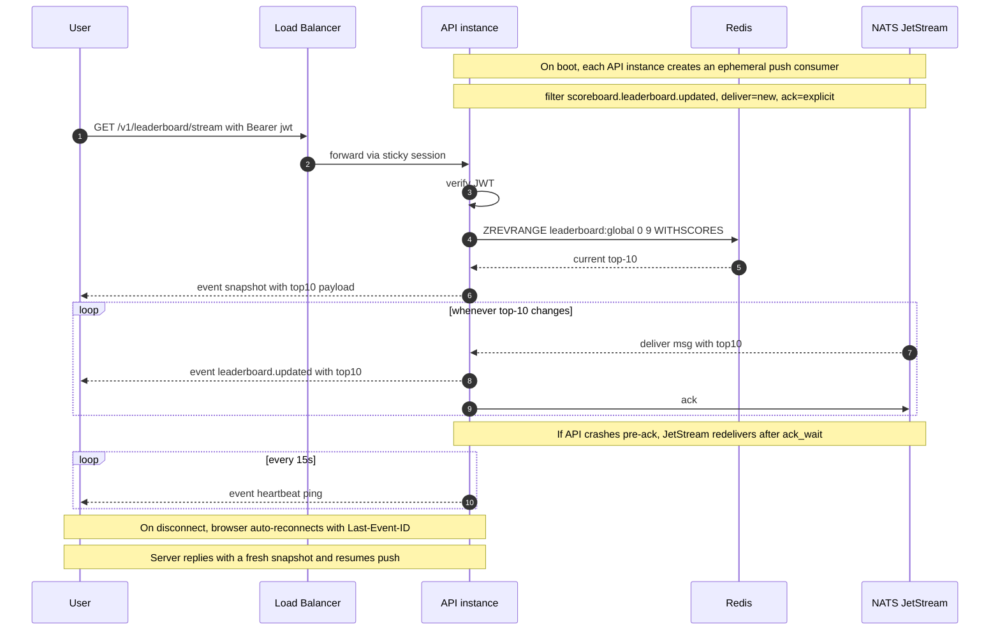
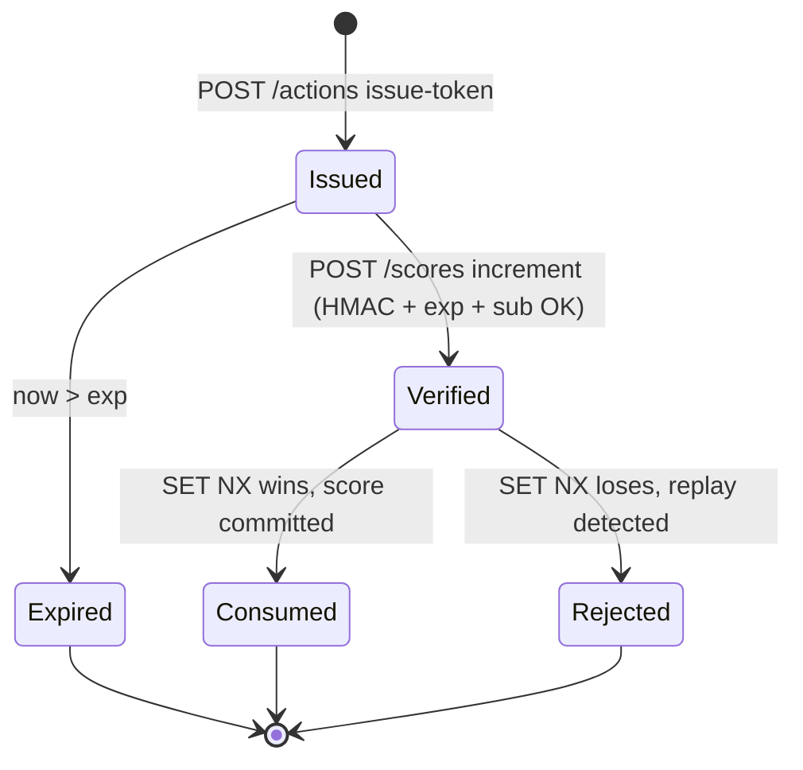
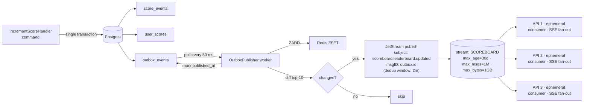

# Flow Diagrams — Scoreboard Module

All diagrams below are [Mermaid](https://mermaid.js.org/). They render natively on GitHub, GitLab, and most modern markdown renderers.

Diagrams:

1. [System Topology](#1-system-topology)
2. [DDD Layering (Hexagonal)](#2-ddd-layering-hexagonal)
3. [Sequence — Issue Action Token](#3-sequence--issue-action-token)
4. [Sequence — Score Increment](#4-sequence--score-increment-happy-path--idempotent-replay)
5. [Sequence — Live Updates via SSE (JetStream)](#5-sequence--live-updates-via-sse-jetstream)
6. [State — Action Token Lifecycle](#6-state--action-token-lifecycle)
7. [Outbox Flow (JetStream publish)](#7-outbox-flow-jetstream-publish)
8. [Failure Modes](#8-failure-modes--what-happens-when)

---

## 1. System Topology

---

## 2. DDD Layering (Hexagonal)

Dependency rule: **arrows only point inward** (toward `domain`). Infrastructure depends on domain; domain depends on nothing. Enforced in CI via `eslint-plugin-boundaries`.

---

## 3. Sequence — Issue Action Token

---

## 4. Sequence — Score Increment (happy path + idempotent replay)

---

## 5. Sequence — Live Updates via SSE (JetStream)

---

## 6. State — Action Token Lifecycle

---

## 7. Outbox Flow (JetStream publish)

---

## 8. Failure Modes — what happens when…

| Failure | Effect | Recovery |
|---|---|---|
| Redis ZSET wiped | `/leaderboard/top` returns 503; writes still commit to Postgres | `LeaderboardRebuilder` rehydrates from Postgres — target < 60 s (NFR-09) |
| JetStream broker down (no quorum) | Publishes return error; outbox row stays unpublished | Outbox publisher retries until quorum returns; `Nats-Msg-Id` dedup prevents duplicates |
| JetStream broker restart (transient) | Brief publish latency; no loss (persisted on replicas) | Automatic — JetStream replication rides through |
| Ephemeral consumer dies | That API instance stops receiving updates | `inactive_threshold=30s` garbage-collects the dead consumer; the live instance recreates a fresh one on next boot |
| API instance killed mid-SSE write | That client's in-flight message is redelivered to another consumer after `ack_wait` (5 s) | Browser auto-reconnects via `EventSource`; gets fresh snapshot + resumed push on the surviving instance |
| JetStream message exceeds retention (30 d) | Old messages expire; new subscribers only see the last month of history | By design — SSE clients always get a fresh snapshot from Redis on connect. MVP retention is sized for debugging, not steady state. |
| Postgres primary down | Writes fail with 503; reads continue from replica + cache | Failover; outbox publisher resumes from `published_at IS NULL` |
| Outbox publisher hangs | Writes still commit; live updates stop flowing | `outbox:lock` TTL expires → another instance claims leadership |
| Action-token secret rotated | In-flight tokens rejected | Dual-secret verification window during rotation (I-SEC-04) |

---

## Notes on Notation

- **Solid arrows** = synchronous calls within a request.
- **Dotted arrows** = asynchronous / eventual.
- **Sticky sessions** only apply to `/leaderboard/stream`; REST endpoints are session-free.
- Diagrams intentionally omit retry loops and TLS termination to stay readable; both are assumed.
- JetStream consumer semantics use `DeliverPolicy.New` + `AckPolicy.Explicit` + `inactive_threshold` for ephemeral, garbage-collected per-instance subscriptions.
